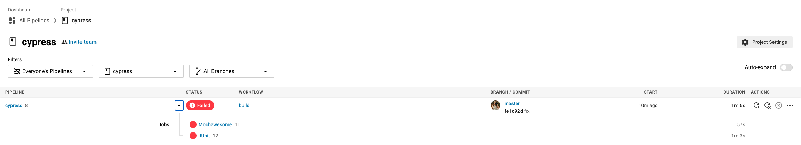
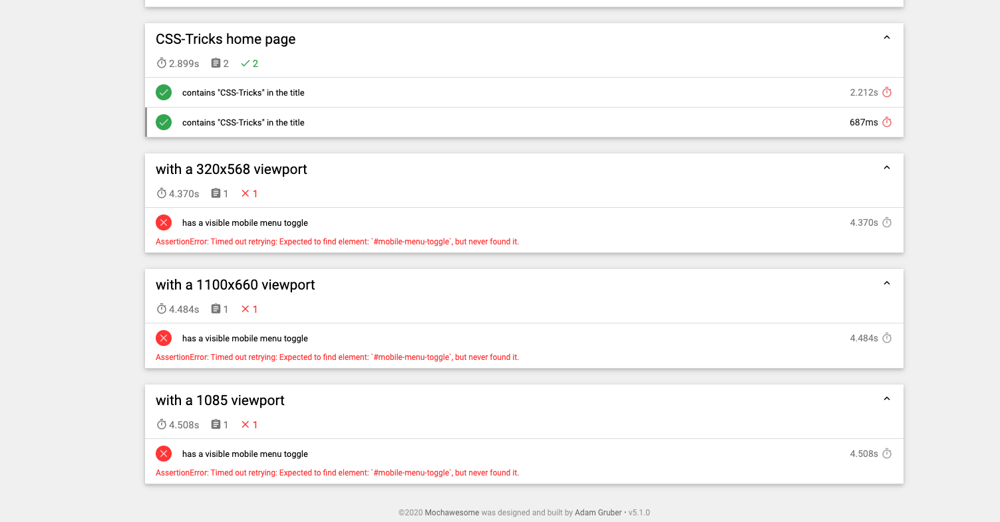
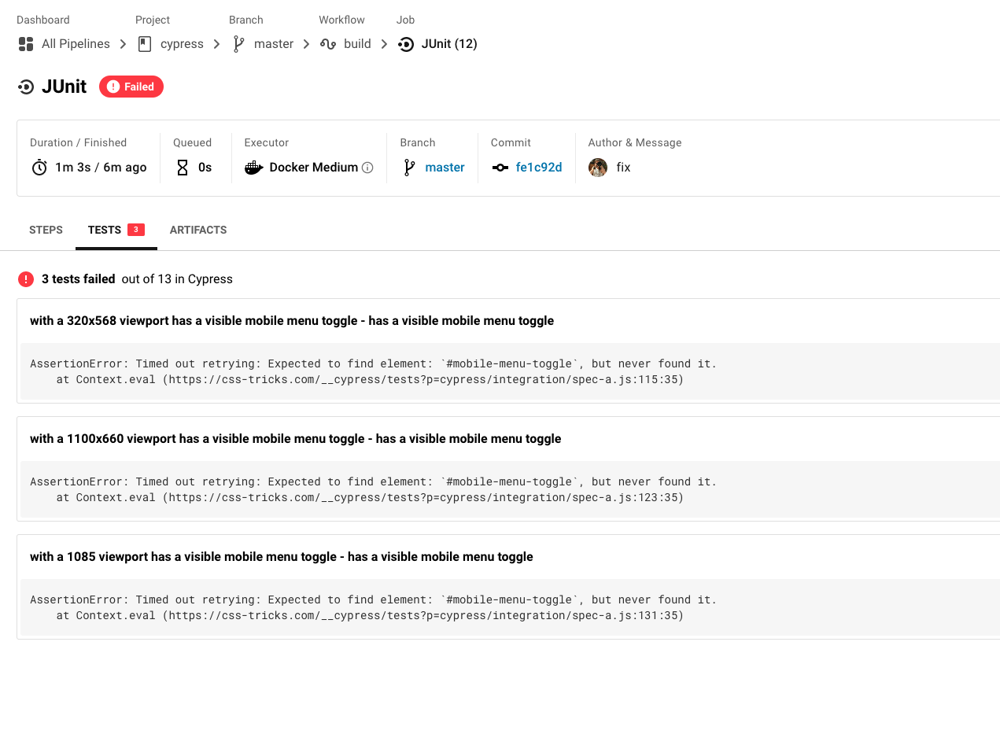
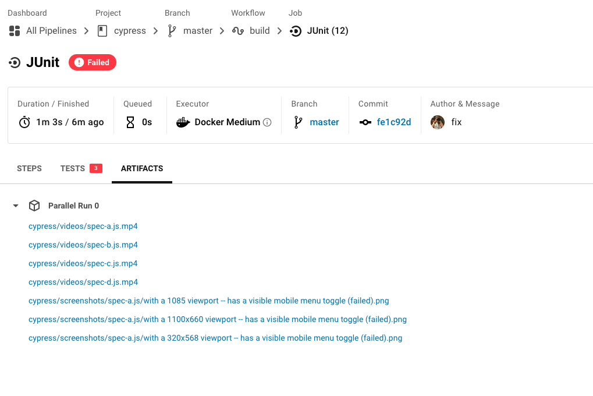

## CI

The tests are executed on [CircleCI](https://app.circleci.com/pipelines/github/Benedicttt/cypress), see configuration file [circle.yml](.circleci/config.yml). One job generates Mochawesome report, while the second one stores JUnit test results. Both jobs store automatic screenshots and videos.

## Mochawesome

On each CI run, the generated Mochawesome report is stored as a test artifact

The report is a static site

## JUnit

JUnit test results are generated using NPM script `test:junit` and are stored on Circle.

When a test fails, the error message and stack trace is shown in the test results

Screenshots and videos stored as test artifacts can help debug the failures

***Creator project Serhii Kyivskyi***